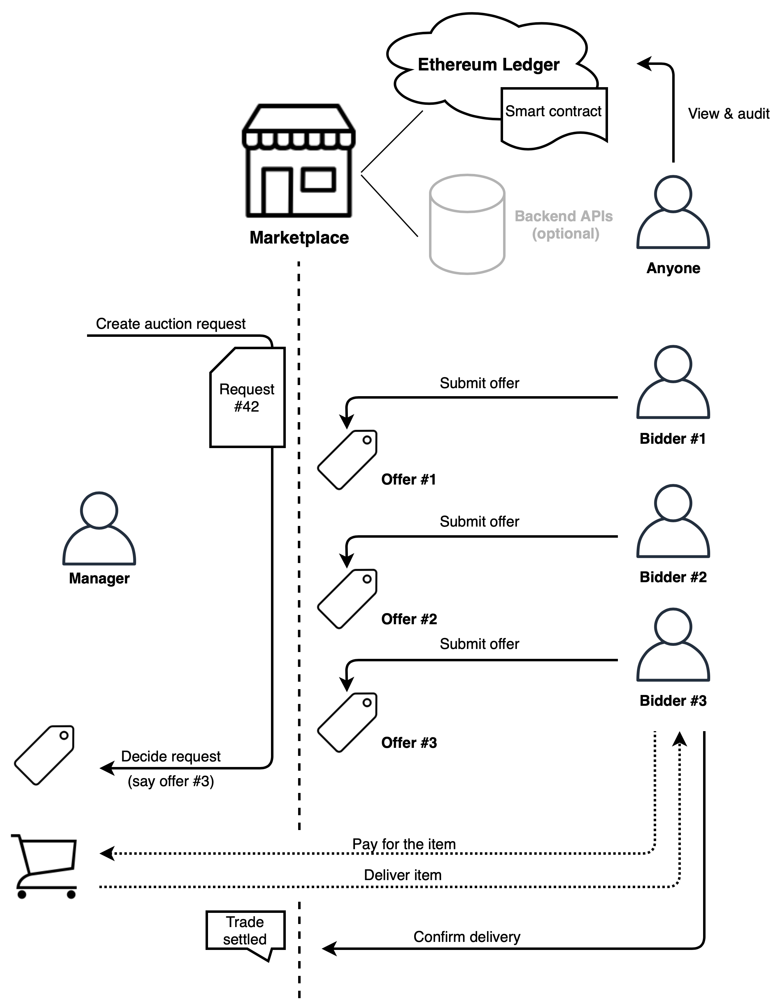
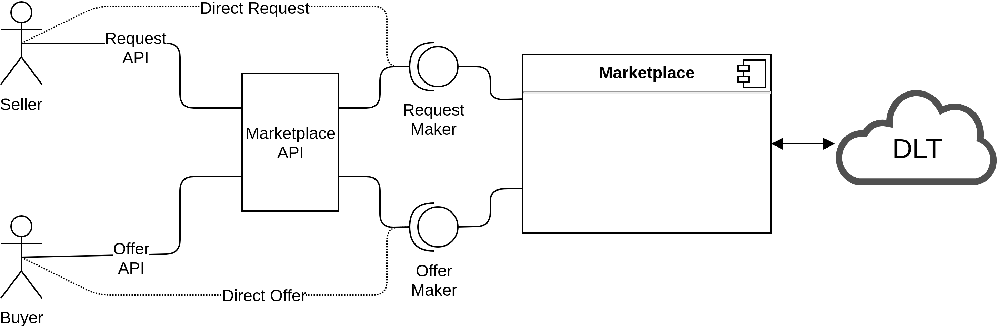
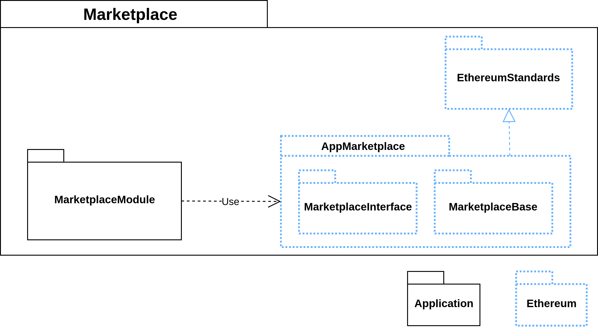

# Marketplace

## Table of Contents
- [Description](#Description)
    - [Architechture Overview](#Architecture-Overview)
    - [Relation with SOFIE](#Relation-with-SOFIE)
    - [Key Technologies](#Key-Technologies)
- [Usage](#Usage)
    - [Prerequisites](#Prerequisites)
    - [Installation](#Installation)
    - [Execution](#Execution)
    - [Re-using the template](#Re-using-the-template)
    - [Docker Images](#Docker-Images)
- [Testing](#Testing)
    - [Prerequisites](#Prerequisites)
    - [Running the Tests](#Running-the-Tests)
    - [Evaluating Results](Evaluating-Results)
- [Generating Documentation](#Generating-Documentation)
- [Open Issues](#Open-Issues)
- [Future Work](#Future-Work)
- [Release Notes](#Release-Notes)
- [Contact Info](#Contact-Info)
- [License](#License)

## Description
This is the Marketplace component of the [SOFIE Framework](https://github.com/SOFIE-project/Framework).

The SOFIE Marketplace component provides a trading platform based on a generic request-offer (or
proposal-bid) transaction model. It can be used to implement auctions using different pricing models and follow the trade transactions to conclusion including successful receipt of the traded item.

Examples of how the Marketplace can be used include
- [flower marketplace](doc/examples.md/#Flower-Marketplace) and the [beach chair marketplace](doc/examples.md/#Beach-Chair-Marketplace), which are auctions, where the highest bid (or lowest depending on the auction)  wins
- [house renovation marketplace](doc/examples.md/#House-Renovation-Marketplace), which is a fixed price auction

### Architecture Overview

The goal of the SOFIE Marketplace component is to enable the trade of
different types of assets in an automated, decentralised, and flexible
way using *Ethereum smart contracts*.



*Figure 1: The flow of an auction using the Marketplace component*

Figure 1 show, how an auction takes place using the Marketplace component. First, the party wishing to sell something (Manager) creates a new auction, after which the potential buyers can submit their bids. Once the bidding time concludes, the Manager closes the auction and decides the winner. The winning bid can be the highest or the lowest depending on the type of auction as the Marketplace component supports [different pricing models](#Pricing-models). The winner then [pays for the item](#Payment-for-the-item) and the Manager delivers the item. Finally, the winner [confirms successful reception of the item](#Trade-settlement), thus creating a complete audit trail of the auction event. At any time, anyoune with access to the Marketplace (Marketplace can be public or limited to members only) can view and audit the status of the Marketplace.

#### Pricing models

On the application logic level, the following two types of pricing models have been implemented with concrete smart contract examples:

- **Simple bidding**: In this model, as long as a request remains open, new offers can be added. Finally, when the auction closes, the offer with the highest (or lowest, depending on the aution type) price is selected. The example use cases of the [flower marketplace](doc/examples.md/#Flower-Marketplace) and the [beach chair marketplace](doc/examples.md/#Beach-Chair-Marketplace) show the details of mechanism for this type of pricing model.

- **Fixed price**: The fixed price bidding model allows the request maker to set a threshold value, and the first offer that reaches wins the request. The [house renovation marketplace](doc/examples.md/#House-Renovation-Marketplace) is an example of this type of pricing model.

#### Payment for the item

The payment for the winning bid can implemented in different ways. Marketplace component provides support for making the payment using ethers, which means the payment can be combined together with the request/offer decision cycle as ethers directly, or can be a separate method implemented by the application smart contracts. The first approach is supported by interfaces like `submitOfferArrayExtra` which allows passing ethers together with offer data. The second approach can be found in the example provided by the [Energy Marketplace](/doc/examples.md#Energy-Marketplace). Alternatively, the payment can be made outside the Marketplace in which case it is up to the application to integrate the payment to the auction process.


#### Trade settlement

An [interface](solidity/contracts/interfaces/TradeResource.sol) allows the winner of an auction to confirm that the traded item has actually been delivered, and thus, the auction as a whole has been settled. The interface has been implemented as the `settleTrade` function in the [Abstract Marketplace](solidity/contracts/abstract/AbstractMarketPlace.sol), where a corresponding event `TradeSettled` is emitted, so that applications can subscribe and get notified once the resource is delivered. Applications  can further expand the logic in the smart contracts to allow allow e.g. external oracle addresses to confirm the delivery of the item.

#### Component interfaces and structure
Figure 2 shows an overview of the Marketplace component and its interfaces. 
The Marketplace component offers two interfaces: *Request Maker* for sellers 
to create, manage, and conclude auctions, and *Offer Maker* for buyers to 
participate and bid in auctions.



*Figure 2: Marketplace component's interfaces*

Figure 3 shows an internal structure of the Marketplace component. 
*MarketplaceModule* includes functionality to communicate with Marketplace smart 
contracts (which are shown as dotted lines). *MarketplaceInterface* smart contract 
includes *Offer Maker* and *Request Maker* interfaces. *MarketplaceBase* includes all 
the base functionalities for the Marketplace component, while *EthereumStandards*
includes the standard Ethereum tokens like
[ERC20](https://github.com/ethereum/EIPs/blob/master/EIPS/eip-20.md).




*Figure 3: Internal structure of the Marketplace component*

The component's technical design and architecture documentation can be
found in the [doc](/doc/) directory.

### Relation with SOFIE

This repository contains a **template** that implements the *Offer Marketplace* business platform as described as part of the SOFIE project's [Business Platforms document](https://media.voog.com/0000/0042/0957/files/SOFIE_D3.2-Business_Platform_Lab_Prototype_Release.pdf).

### Key Technologies

This component uses [*Flask*](https://palletsprojects.com/p/flask/) for back-end web services 
and *Ethereum Smart Contracts* written in [*Solidity*](https://solidity.readthedocs.io/) for interacting with [*Ethereum Blockchain*](https://ethereum.org/). Also, *offer-marketplace-cli* uses [*web3.py*](https://github.com/ethereum/web3.py) library in order to interact with the smart contracts.


***

## Usage

The SOFIE Marketplace component is composed of the following parts:
* Solidity smart contracts located in `solidity/contracts` and `solidity/vendors/ENG` directories
* Flask backend for interacting with smart contracts (currently under development and not finished yet) located in `src/sofie_offer_marketplace/backend`
* Command line tool for interacting with Marketplace located in `sofie_offer_marketplace_cli`
* Python Marketplace classes used by the backend and command line tool located in `src/sofie_offer_marketplace`


### Prerequisites

You can install dependencies for the Flask backend and Command line tool by running the following commands (requires Python setuptools package, which can be installed by running: `pip install setuptools`):

	$ python3 setup.py build
	$ python3 setup.py install
	
You can skip the steps above when interacting with smart contracts directly.

### Installation

#### Install Smart Contracts using NPM

Users who need the essential smart contracts related to Marketplace interfaces and their example implementations only, have the option to use the separate [SOFIE Marketplace npm module](https://www.npmjs.com/package/sofie-offer-marketplace) without the need to include this whole repository.

```bash
npm install sofie-offer-marketplace
```

This command installs the module with all the essential smart contracts of interfaces and template implementations. These can then be extended for a custom application logic.

### Execution

#### CLI 
For trying out the marketplace tool `offer-marketplace-cli`, following steps 
should be performed. First, set up truffle and a local Ethereum node 
(Ganache CLI, for example):

	$ cd solidity/
	$ npm install
	$ npm install -g ganache-cli
	$ ganache-cli -p 7545
	$ npx truffle migrate --reset --network marketplace
	$ cd ..
	
Then:

	$ export WEB3_PROVIDER_URI=http://localhost:7545
	$ export MARKETPLACE_ACCOUNT=account-id-from-ganache-console
	$ export MARKETPLACE_CONTRACT=contract-from-truffle-migrate
	$ export REGISTERED_ACCOUNT=sofie_offer_marketplace_cli
	$ offer-marketplace-cli --manager add-request "in 5 minutes" 1000 0
	$ offer-marketplace-cli list

Keep in mind that you should use `SET` instead of `export` in Windows.

#### Flask backend APIs

The detailed specification of the APIs including the smart contracts, backend and event callbacks can be found in the [API document](/doc/api.rst). Running a backend requires the ledger, actual Flask backend, Redis database, and Celery task queue.

##### Setting up the Ethereum ledger

An Ethereum network needs to be set up, with the local example using the Ganache tool as follows

```
ganache-cli -p 7545 -b 1
```

Afterwards, the specified smart contract of the marketplace application should be deployed upon it. For the default case, `FlowerMarketplace` smart contracts will be deployed with the following command:

```
make migrate
```

For customized smart contract, it should be deployed using `truffle migrate` or similar.

The dependencies should be installed and the application built as mentioned in the above sections.

First, set the environment variables, including the module for the Flask application, and configure its mode. 

```
export FLASK_APP=src/sofie_offer_marketplace.backend.app
export FLASK_ENV=development
```

##### Run backend server

Then, the backend server can be run with the following command:

```
python -m flask run
```

##### Launch Celery worker for event callbacks

To use the event callbacks features, a separate Celery worker needs be launched to handle the background jobs.

First, run a Redis in the background from Docker as the message broker:

```
docker run -d -p 6379:6379 redis
```

Then the Celery worker can be launched as follows:

```
celery -A sofie_offer_marketplace.backend.app.celery worker --loglevel=INFO
```

##### System tests

With all the steps taken as above, the system tests can then be carried out by the simple command below (Python 3.8 can be used for testing by passing `-e py38` parameters instead):

```
tox -e py36 -v
```

or through a separate visit to the endpoints of the backend APIs

```
curl localhost:5000/info
```


### Re-using the template

## Usage

* Most of the primary code is designed to be loosely coupled and
  re-usable. Thus, while the examples use Flask for building web
  services, the core itself is modularized as a Python library
  and should be re-usable in other environments.

### Docker image

Execute the script `docker-build.sh` to build docker image for the Marketplace component. The Docker image contains the backend listening globally at port 5000. 

***

## Testing

The `tests/marketplace` directory contains the scripts to unit test the backend.
The `solidity/test/` directory contains the scripts to unit test the smart contracts.

### Prerequisites

Tests for the Python components can be run either by using Tox, which will install all Python-related dependencies automatically, or directly using pytest, which can be used to run independent tests. For testing through Makefile, some additional tools (`curl` and `jq`) are needed.

Install Tox:

    $ pip install tox


Or install pytest and dependencies:

    $ pip install pytest pytest-asyncio pytest-mock pytest-mypy

    
To test example smart contracts, install Truffle:

    $ cd solidity/
    $ npm install


### Running the tests

The easiest way to run the tests is with:

        $ make test


This will setup a Docker Compose-based environment containing the local Ethereum node (Ganache), Redis, and Celery, and will also deploy the smart contracts and runs all the tests.

In order to run the tests manually, local Ethereum node, Redis and Celery need to be running, and smart contracts need to be deployed correctly. Please the above section for Flask backend APIs for the manual setup.

Then, to test the Python components manually run either:
```bash
tox
```

Or:
```bash
pytest -v
mypy src tests
```

To test the smart contracts located in `solidity` directory (it compiles them automatically):

    $ make test-contracts


### Evaluating the results

When using Tox and Truffle, test results in JUnit format are stored in `tests` directory. Files `backend_test_results.xml`, `backend_mypy_test_results.xml`, and `smart_contracts_test_results.xml` contain results for the backend tests, backend mypy (static type checked) tests, and smart contract tests respectively.

***

## Generating documentation for Python code

We use a mix of markdown and reStructuredText format for documenting
the project. Python code documentation is autogenerated by using
Sphinx. You can see the `md` and `rst` files in the `doc`
directory. To generate the documentation you should install `sphinx`
and the various sphinx extensions that are used:

    $ pip install 'sphinx<3.0.0' m2r sphinxcontrib-httpdomain sphinxcontrib-soliditydomain sphinxcontrib-seqdiag

Now you can run

    $ make html

to generate documentation. Generated documentation is saved in
`doc/html`. `index.html` is the main page and you can find all
documentations through its links.

***

## Known and Open issues

***

## Future Work

***

## Release Notes
### 2020-09-17
#### Added
- Flask backend APIs related to request, offers and managment operations in the marketplace
- Event callbacks for the events emitted by the smart contracts
- Interface for trading evidence to be used for proof of item delivery

#### Changed
- Automated tests utilise Docker compose environment

***

## Contact info

**Contact**: Wu, Lei lei.1.wu@aalto.fi

**Contributors**: can be found in [authors](AUTHORS) file.

***

## License

This component is licensed under the Apache License 2.0.
