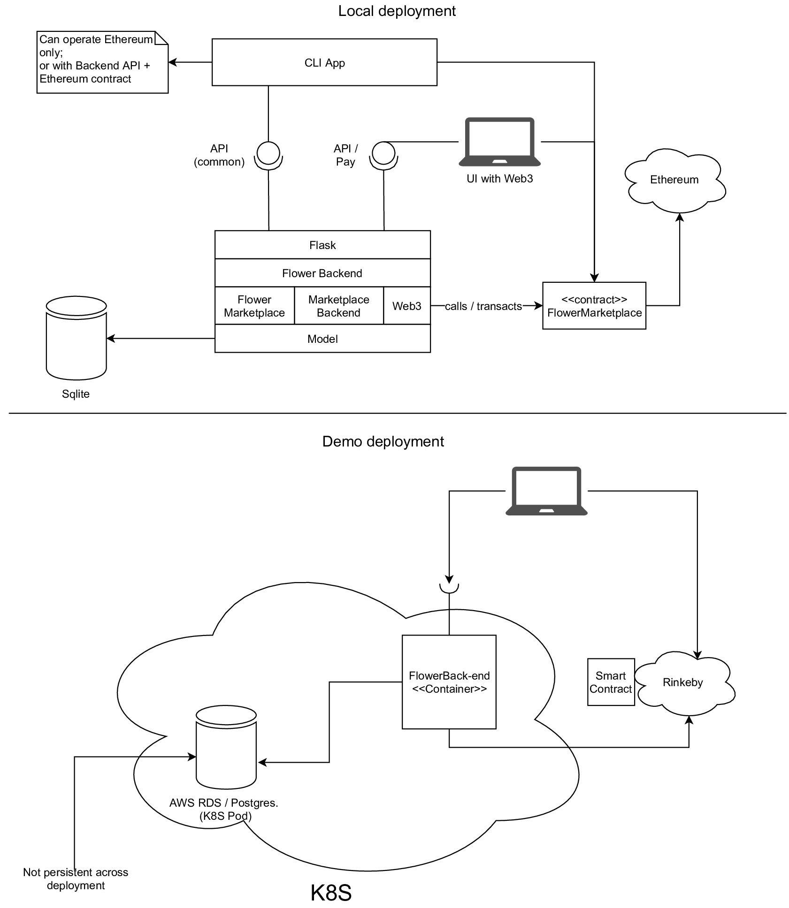

Architecture
============

## Overview

This implementation of the offer marketplace (OM) consists of two main
components:

* **Backend server** that essentially performs all tasks the Ethereum
  smart contract is unable to do. The full extent of this depends a
  bit on the configuration of the setup. This is a REST server with no
  native user-visible web interface (see :doc:`backend`).

  The backend server conforms to the SOFIE framework's requirements on
  service discoverablity, descriptiveness and linkage to DLTs.

* **Smart contract** that is integral in offering the
  non-repudiability of the marketplace request-offer-selection
  process. The full extent on what functionality is in the smart
  contract depends on the setup.

  This smart contract conforms to the SOFIE framework's requirements
  on service discoverability, descriptiveness and linkage to non-DLT
  services (see :doc:`smart-contract`).

The overall marketplace architecture is flexible and can support
marketplace operating in different configurations such as:

* Offers can be made by anyone on the ledger, final decision made by
  the smart contract.

* Offers can be made only by a pre-approved list of entities, final
  decision is made offline (in the backend).

* Offers are not partially (or at all) public, e.g. the information
  about the offers is not public and only a commitment (signed hash)
  is on the ledger.

These are just a few of the possible variations that the **smart
contract and backend interfaces** support. Note that not all
**implementations of these interfaces** are as flexible. The stubs and
examples in this repository implement only a portion of this
flexibility, but the core idea is that the **core APIs** themselves
are useable in all situations.

## Structure

The picture below shows the overall structure of this repository.

There are separate package structures for *Solidity* and *Python*
code. The other relevant distinction is between *core code* and *demo
code*.

The demo code contains flower marketplace, a backend with extended
functionality (HTML pages) etc. that extend beyond the base classes
provided by the core code. A "regular" re-use of the code would base
on the core classes, using the demo code only as an example.

## Deployment

While a "real" deployment can be arbitrary complex, for testing
purposes the demo code is deployed. The repository supports (or will
support) two deployment scenarios: local and Kubernetes. The local
deployment basically is for running development version, and the
Kubernetes version contains an automated setup for a running and
useable demonstration environment. Please see the picture below for
major conseptual and practical differences.

