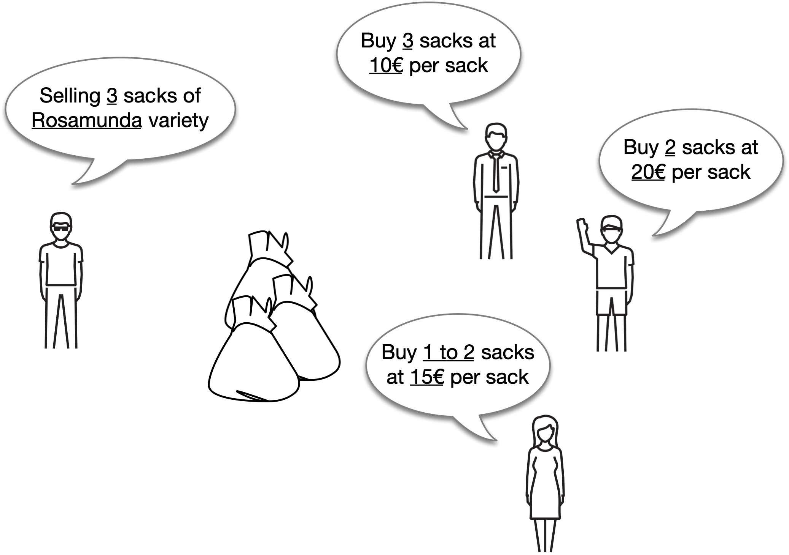
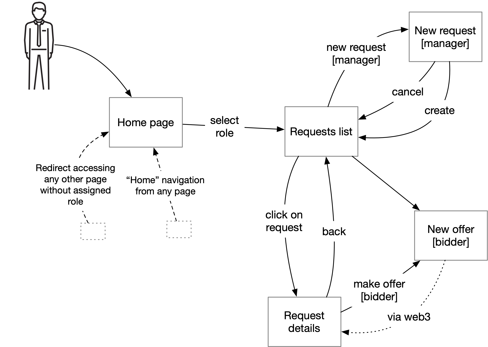
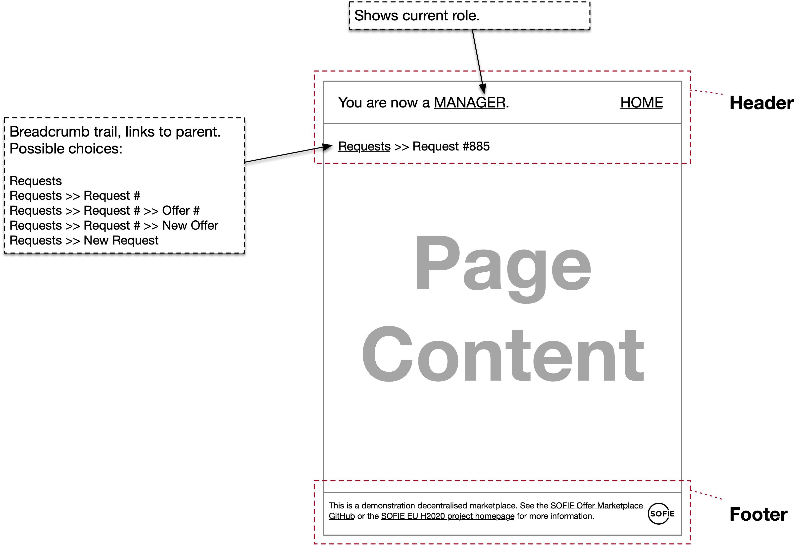
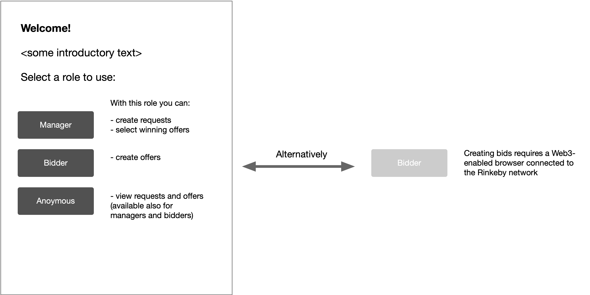
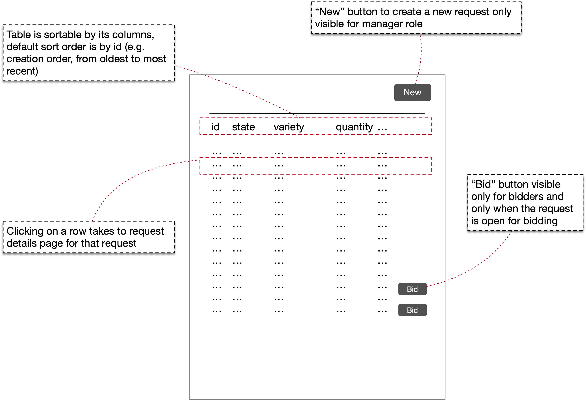
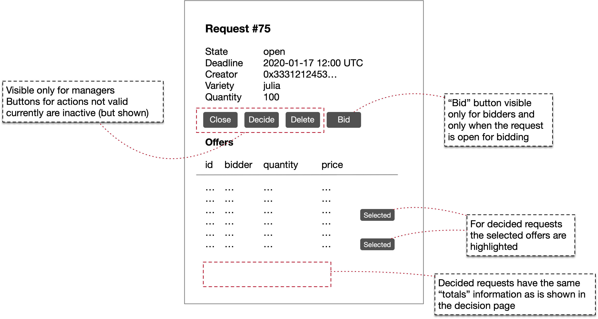

===========================
 Demonstration Marketplace
===========================

The demonstration marketplace is a comprehensive service that consists
of a smart contract, API backend and an user-accessible web
interface. Its implementation is in many places simplistic, but still
tries to demonstrate how the SOFIE Offer Marketplace component can be
reused and extended to differing use cases.

If you are interested in **deploying and using** the demonstration
marketplace, please see :doc:`demo-deployment`.

Marketplace
===========

The demonstration marketplace is a mixed marketplace where request
authority is in the "classical" backend (with data being replicated
for auditability into the ledger), with offer authority on the ledger,
e.g. offers are made directly to the ledger and the backend offer API
uses data from the ledger. Finally, decisions are made in the backend
--- this implementation gives the authority on the selection of offers
to a "manager" role.

The demonstration marketplace is set for selling potatoes of different
varieties. These are sold by the sack. The marketplace owner is the
entity selling the potatoes and is looking for bids (offers to
buy). The bidders indicate how many sacks they are looking to buy and
the price per sack they are willing to pay. The bidders also indicate
the **minimum** number of sacks they will accept --- e.g. they
indicate a quantity range.

   Selling and buying potatoes on the demonstration marketplace.

The marketplace offers a full read-only API access to everybody, with
request creation and decision restricted to managers. Offers can not
be created using the backend, and bidders must create offers on the
ledger (using a Web3-enabled browser, or interacting directly with the
contract via geth or similar tool).

User Interface
==============

The user interface is a pretty basic web interface implementing the
basic CRUD operations for requests and offers. The permitted
operations are identified by the user's **role**. There are three
roles:

  * Manager
  * Bidder
  * Anonymous
  * (Unknown)

Any user without a known role has "unknown" role and is redirected to
the home page. The home page allows the user to select what role to
use --- there is no authentication, but there **is** access control!

   The overall flows between different pages in the demonstration
   marketplace.

If user tries to access any HTML page without a valid role (e.g. if
they have not chosen a role or navigated to the home page, they are
"unknown") they are redirected to the home page.

Header and Footer
-----------------

.. note::

   All of the page layouts below are sketches and intended to focus on
   the relevant interaction elements on the page. The actual pages can
   the same functionality in slightly different format as well as
   other visual embellishments.

The individual pages are listed more in detail below, but they all
have a similar header and footer structure (apart from the home page
which does not have the header):

   Common header and footer for all pages (except no header on home
   page).

Home Page
---------

The home page is simple and has some generic help text. It also offers
the user a chance to select between the manager, bidder and anonymous
roles. When the role button is clicked the user is redirected to the
*requests list* page.

   Home page primarily offers generic help text and allow the user to
   choose one of the available roles.

The bidder role requires a Web3-compatible browser that is connected
to the correct Ethereum network. The browser needs to selectively
enable or disable the button and change the text according to the
context:

============   ===================  ==================  ======================
Web3 present   Network ID matches?  `getType` matches?  Message (meaning)
============   ===================  ==================  ======================
No             --                   --                  Web3 required
Yes            No                   --                  Incorrect network
Yes            Yes                  No                  Marketplace not setup
============   ===================  ==================  ======================

Since the network id, smart contract address and the contract type are
known *a priori* to be backend, this information can be embedded in
the HTML page and then used by the client to check that it 1) is on
the correct network and 2) the smart contract exists (a call to it
succeeds) and 3) the type of the marketplace is correct.

Requests List
-------------

The request list page is straightforward listing of all known
requests. A button to initiate creation of a new request is available
for managers, and a shortcut for bidding on a specific request is
available for bidders. This is a demonstration marketplace so no
effort is put into paging, filter etc. features.

   List of requests, with functionality to sort columns and some
   conditional actions based on the user's role.

Request Details
---------------

The request details page shows all of the available information on a
request (some may be omitted for brevity from the listing page), and
lists all offers made on the request. It also offers request lifecycle
management for the manager, and a method of initiating a bid creation
for bidders.

   Details of a single request, showing all of the offers made on the
   request as well as actions available according to the user's role.

Note that the list of offers is --- apart from the selection
checkboxes --- identical between this and the request decision page.

Decide Request
--------------

This page is available only for managers, and only for requests that
have not been already decided. If either condition is not satisfied,
the user is redirected to the request details page.

This is **mostly** like the request details page except:

  * Most of the detail fields are omitted, showing only *variety* and
    *quantity* fields. Similarly, the action bar is not shown.
  * Each offer has a checkbox, initially unselected.
  * Below the offer list "totals" fields are shown that *and dynamically
    updated*:

    * The sum of quantities of selected offers
    * The sum of (quantity * price) over all selected offers

  * "DECIDE" and "CANCEL" buttons. The decide button is inactive if
    the total quantity of selected offers is larger than the request
    quantity (but active otherwise -- the manager is allowed to select
    *less* than the maximum quantity of offers).

The manager can click on checkbox of an offer, or anywhere on the
offer row to toggle the checkbox. The totals are updated whenever the
set of selected offers is changed.

New Request
-----------

The new request page has the basic creation functionality for a
request. The page is accessible only for managers. The available
actions for the user are either "CREATE" or "CANCEL". The client needs
to perform local validation on the input fields, since the
:http:post:`/request/` API does not provide detailed failure
rationale.

New Offer
---------

The new offer page is available only for bidders. It offers the basic
input and validation functionality on the required fields.

However, since offers are created on the ledger and not by the
backend, the process of creating a new bid offer actually requires the
following steps:

1. Create a new transaction to call
   :sol:interface:`MarketPlace.submitOffer`.
2. Wait for the transaction to complete (show a spinner and deactivate
   buttons). On error, show the error and stop.
3. Create a new transcation to call
   :sol:interface:`MarketPlace.submitOfferExtra`.
4. Wait for the transaction to complete (spinner etc.). On error, show
   error.
5. If all went well, go to the request detail page (highlight the
   newly created offer row).

Implementation
==============

The demonstration marketplace implementation consists of:

1. Smart contract. This extends from the abstract base classes and
   implements access controls for request lifecycle events restricting
   them to the contract owner address.
2. Web server containing:

   * Offer Marketplace API Backend located at `/api/` prefix,
     configured to be authority for requests, require manager role for
     request lifecycle operations, and be a read-only view for offers.
   * Serve HTML pages
   * Implement a role-changing `PUT` endpoint (required to let the
     user change roles) that updates the user session information
3. HTML pages containing Javascript client-side code for fetching and
   rendering information and performing request lifecycle operations,
   as well as Web3-using code to create offers

   (*Note this is not a single page application!* All pages are served
   from the server, but the pages themselves fetch data using the
   Offer Marketplace Backend APIs.)

Access control is solely based on client-side session (encrypted
cookie) which stores the current role. The role is reset to "unknown"
when the user navigates to the home page. The access control applies
both to HTML pages as well as API. That is, for a manager to be able
to use the :http:post:`/request/` they must have 1) the session cookie
and 2) have their role set in the session as "manager".
